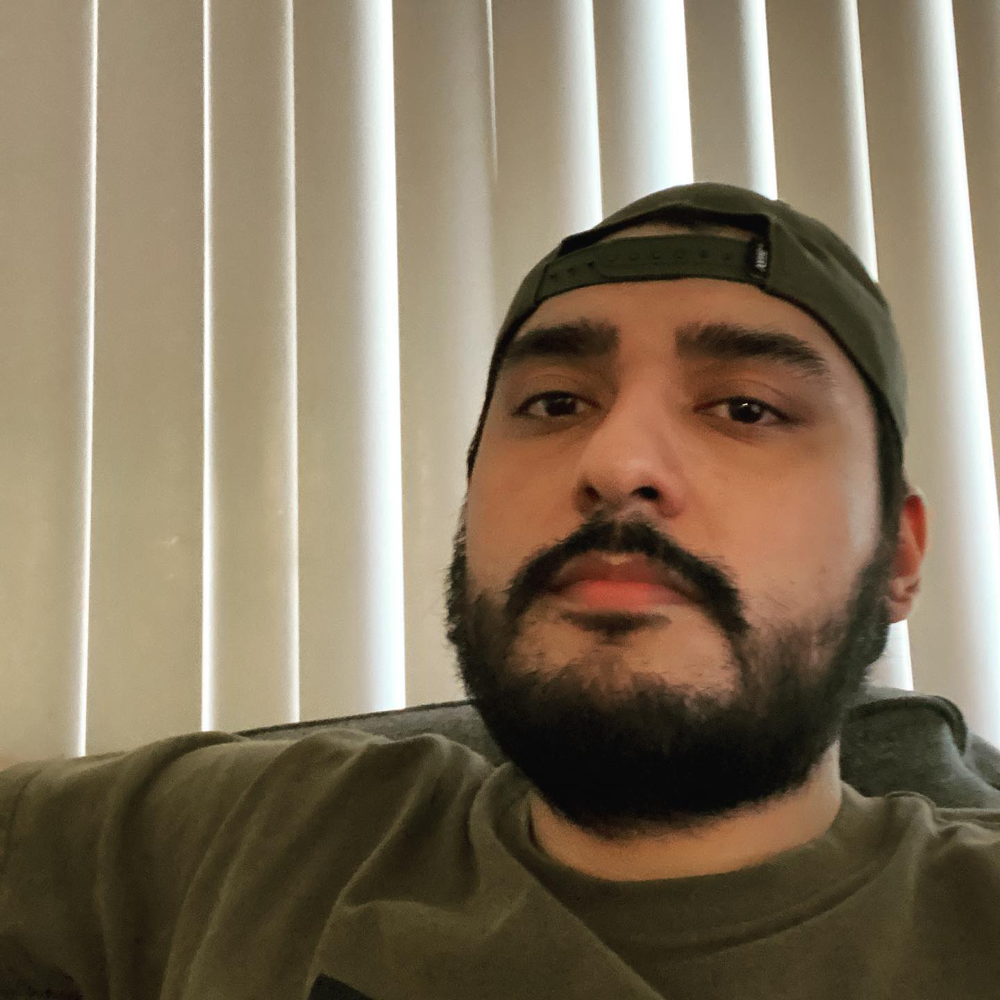
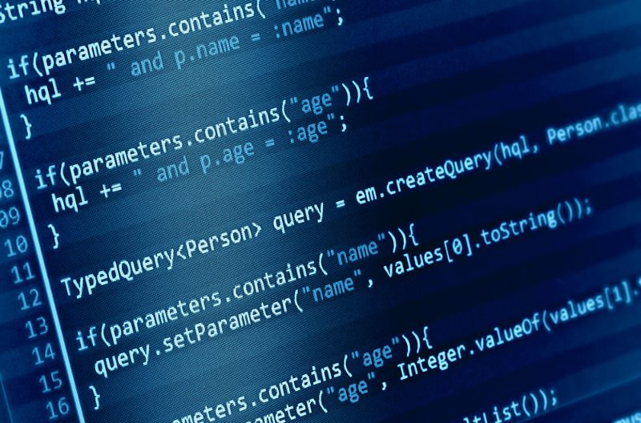

# Alexander G. Arias's GitHub User Page :fire:
## The coolest page in the world! :earth_africa:
### NAY! THE GALAXY! :space_invader:
#### DOUBLE NAY! THE UNIVERSE! :alien:
##### Now I am just doing this on purpose! :100:
###### A "little" imagination and humor never hurts, no pun intended... :rofl:

## About Me as A Person:

I am a 27-year-old hispanic white male who comes from a poor family. Growing up poor was kind of difficult. However, I never allowed my
circumstances to prevent me from becoming someone of value or inpirational. **I am married**, and __I have two children__. My first born is a boy, and he turns 3 on october first. My second born is a girl, and she turns 1 on november the third. 

My wife, son, and daughter's name are as follows in the bellow unordered list: 

- Hillary Arias
- Alexander G. Arias Jr.
- Hailey A. Arias

*Being a parent has been a beautiful and wonderful experience*, but sometimes it can be a bit challenging. I first started attending college in 2017 and I recently graduated with 4 associates degrees. _My associates degrees are in the following fields: Computer Science, Mathematics, Physics, and University Math/Science._ ~~I worked my butt off to graduate with distinctrion in all four of my degrees.~~ I hope that this may provide some information about my work ethic. 

**I joined the military when I was 18, and I served as an _[Infantry Mortarman](https://www.youtube.com/watch?v=8qjOK7e0J7o ) in the [US ARMY](https://www.goarmy.com/careers-and-jobs/career-match.html?iom=BEDB-22-NMTF_N_PSEA_71700000091265616_700000002151505_43700069701671244_58700007695217968_us+army&gclid=EAIaIQobChMIo8vNotyr-gIV9jytBh0xQgtEEAAYASAAEgL24PD_BwE&gclsrc=aw.ds)_. I got out the military with an [Expert Infantrymans Badge](https://en.wikipedia.org/wiki/Expert_Infantryman_Badge) and a few memorable medals.** As a veteran, I really strive to make an impression. I am highly disciplined and responsible. The military has instilled various values in my ethos like: duty, honor, integrity, respect, bravery, resciliency, and more. I sometimes find myself missing the military, but I then come to my senses and think: boy I am high! Serving is not easy, and it is a lifestyle I valued while it lasted. 

You might be thinking: Man! Alexander sure is a bit of a showoff. However, tragedy can stike anyone. Last year, in the summer of 2021, **I was diagnosed with [cancer](https://lymphoma.org/understanding-lymphoma/aboutlymphoma/nhl/dlbcl/).** After being convinced by family, I decided to attend the fall quarter of 2021 and fight cancer at the same time! **Word of advice: DON'T FIGHT CANCER AND GO TO SCHOOL!** After beating cancer and getting straight A's, I found myself riddled with trauma and depression. 

> Never be game over! 

This is one of the most prominant quotes from my favorite videogame series:

> Metal Gear Solid. 

I decided to take the winter quarter off this year, but decided to reattend during the spring semester. I hit remission in winter 2022. I hope that my experiences can show you a thing or two about my character and personality.

## About Me as a Programmer:

I consider myself a very good programmer. I somewhat believe that I am up in the top undergraduate programmers here at UCSD, but this is extremely biased. Since arriving at UCSD, I have always aced my programming assignments. I mostly attribute my success to my discipline and dedication. Unfortunatley, being a good programmer tends to attract those other programmers that can be a bit lazy. I tend to be very empathetic when dealing with computer science, but this has caused me to deal with academic integrity in the past. As a a result, I refuse to help people by any means when it is not allowed. 

My favorite data structure that has allowed me to be very successul to this day has been the `Vector`, or `Array`. In other words, I really abuse arrays! If I had to scale my preferred CSE classes that I have taken so far in an ordered list, with the list becoming least preferred as you go down the list, It would be the following:

1. CSE 100
   - I had the most fun in this class!
2. CSE 12
3. CSE 15L
4. CSE 30
5. CSE 105
6. CSE 8B
7. CSE 8A
8. CSE 21
   - I was fighting cancer during this class, which might explain why it is my least preferred. 

Overall, this list is only bound to get bigger. I have recieved an A in all of these classes, but this does not mean they were easy nor fun. I am currently taking CSE 101, 110, and 167. I hope that these courses can continue to teach me more about what it truly means to be a programmer as I am still learning about what being a programmer truly means. As a first generation programmer, It is difficult to compare my experience or even share a passion I have for computer science since I do not know much beyond what I have learned here at UCSD. 

Anyways, while taking this LAB week 0-1, I realised that the instructions state to use `git branch name_of_new_branch`. After creating this branch, it asks the user to `git checkout name_of_new_branch`. While looking at an online reference, it mentions that we need to type `git branch` after that so that we may make new changes in the new branch. I did not do this, and somehow all my work still worked. So I am a bit confused by this, but I hope to keep learning about git and other cool things throughout the quarter!

## My Goals for CSE 110

- [ ] Try to get an A in the course.
- [ ] Become and maintain my position as a productive member in my software engineering team.
- [ ] Ensure I am getting rest while ensuring I finish every assignment for this class in a timely manner. 
- [ ] Form great connections with my profesor and engineering team. 
  
I hope to update this tasks list in greater detail throught the quarter and hopefully be able to check everymark at the end of the quarter. :smile:

